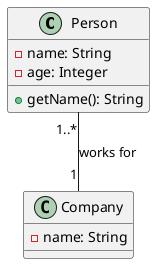
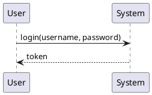
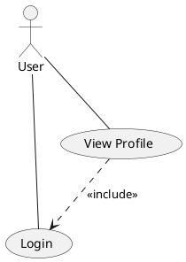
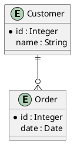

# puml-ld

A Ruby Sinatra web service that converts PlantUML diagram documents into JSON-LD (Linked Data) format with SHACL shape validation support.

## Overview

PlantUML documents are designed for visual display and human consumption. The **puml-ld** service transforms these diagrams into machine-readable, semantically rich JSON-LD documents suitable for storage, querying, and integration with knowledge graphs and semantic web applications.

## Features

- **PlantUML to JSON-LD Conversion**: Converts PlantUML diagrams to structured JSON-LD format
- **Multiple Diagram Types**: Supports Class, Sequence, Use Case, and ERD diagrams
- **SHACL Shapes**: Provides SHACL constraint definitions for diagram validation
- **Flexible Context**: Accepts custom JSON-LD contexts via headers
- **RESTful API**: Simple HTTP endpoints for conversion and shape retrieval

## Requirements

- Ruby 3.3.6
- Bundler

## Installation

1. Clone or download the repository
2. Install dependencies:

```bash
bundle install
```

## Running the Application

Start the server using Rackup:

```bash
bundle exec rackup -p 4567
```

Or using Puma directly:

```bash
bundle exec puma -p 4567
```

The application will be available at `http://localhost:4567`

## API Endpoints

### GET /

Returns API information and available endpoints.

**Example:**
```bash
curl http://localhost:4567/
```

### GET /shacl?name={DiagramType}

Retrieves SHACL shape definitions for a specific diagram type.

**Parameters:**
- `name` (required): Diagram type (Class, Sequence, UseCase, ERD)

**Example:**
```bash
curl http://localhost:4567/shacl?name=Class
```

**Response:** Turtle format SHACL shape definition

### PUT /convert

Converts PlantUML source code to JSON-LD format.

**Headers:**
- `Context` (required): JSON-LD context URL or inline JSON object
- `Id` (required): Base IRI for generated resources

**Body:** PlantUML source code (text/plain)

**Example:**
```bash
curl -X PUT http://localhost:4567/convert \
  -H "Context: http://example.org/contexts/uml.jsonld" \
  -H "Id: http://example.org/diagrams/mydiagram" \
  -H "Content-Type: text/plain" \
  --data '@startuml
class Person {
  -name: String
  -age: Integer
  +getName(): String
}
@enduml'
```

**Response:** JSON-LD document

### GET /health

Health check endpoint.

**Example:**
```bash
curl http://localhost:4567/health
```

## Supported Diagram Types

### Class Diagrams

Converts UML class diagrams including:
- Classes, interfaces, enums
- Attributes with visibility and types
- Methods with parameters and return types
- Relationships (association, inheritance, composition, etc.)
- Stereotypes and abstract modifiers

**Example PlantUML:**


### Sequence Diagrams

Converts sequence diagrams including:
- Participants (actors, boundaries, entities, etc.)
- Messages between participants
- Synchronous and asynchronous calls

**Example PlantUML:**


### Use Case Diagrams

Converts use case diagrams including:
- Actors
- Use cases
- Relationships (associations, includes, extends)

**Example PlantUML:**


### Entity Relationship Diagrams (ERD)

Converts ERD diagrams including:
- Entities
- Attributes
- Relationships with cardinality

**Example PlantUML:**


## JSON-LD Context

The application accepts JSON-LD context in two formats:

### External Context (URL)
```bash
-H "Context: https://example.org/contexts/uml.jsonld"
```

### Inline Context (JSON)
```bash
-H 'Context: {"@vocab": "http://example.org/uml#", "name": "rdfs:label"}'
```

## Example JSON-LD Output

```json
{
  "@context": {
    "@vocab": "http://example.org/uml#",
    "name": "rdfs:label"
  },
  "@graph": [
    {
      "@id": "http://example.org/diagrams/mydiagram",
      "@type": "ClassDiagram",
      "elementCount": 1,
      "relationshipCount": 0
    },
    {
      "@id": "http://example.org/diagrams/mydiagram#Person",
      "@type": "Class",
      "name": "Person",
      "attributes": [
        {
          "@type": "Attribute",
          "name": "name",
          "datatype": "String",
          "visibility": "private"
        },
        {
          "@type": "Attribute",
          "name": "age",
          "datatype": "Integer",
          "visibility": "private"
        }
      ],
      "methods": [
        {
          "@type": "Method",
          "name": "getName",
          "returnType": "String",
          "visibility": "public"
        }
      ]
    }
  ]
}
```

## SHACL Shapes

SHACL shapes are provided for validating the structure of converted JSON-LD documents. Shapes are available for:

- **Class Diagrams**: Validates classes, interfaces, attributes, methods, and relationships
- **Sequence Diagrams**: Validates participants and messages
- **Use Case Diagrams**: Validates actors, use cases, and relationships
- **ERD Diagrams**: Validates entities, attributes, and relationships with cardinality

Shapes are stored in the `shapes/` directory in Turtle format.

## Project Structure

```
puml-ld/
├── app.rb                  # Main Sinatra application
├── config.ru               # Rack configuration
├── Gemfile                 # Ruby dependencies
├── lib/
│   ├── puml_parser.rb      # PlantUML parser
│   ├── jsonld_converter.rb # JSON-LD converter
│   └── shacl_repository.rb # SHACL shape repository
├── shapes/                 # SHACL shape definitions
│   ├── class_shape.ttl
│   ├── sequence_shape.ttl
│   ├── usecase_shape.ttl
│   └── erd_shape.ttl
├── spec/                   # RSpec tests
└── features/               # Cucumber tests
```

## Testing

Run RSpec tests:
```bash
bundle exec rspec
```

Run Cucumber tests:
```bash
bundle exec cucumber
```

## Error Handling

The application provides clear error responses:

- **400 Bad Request**: Missing required parameters or headers
- **404 Not Found**: SHACL shape not found for requested diagram type
- **422 Unprocessable Entity**: PlantUML syntax error or parsing failure
- **500 Internal Server Error**: Conversion failure or unexpected error

## License

This project is provided as-is for educational and development purposes.

## Contributing

Contributions are welcome! Please ensure all tests pass before submitting pull requests.

## Author

Created as a demonstration of PlantUML to JSON-LD conversion with SHACL validation support.
