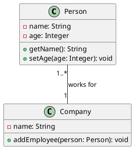
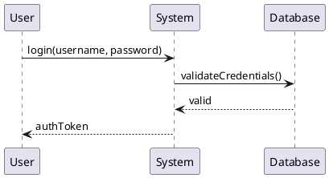
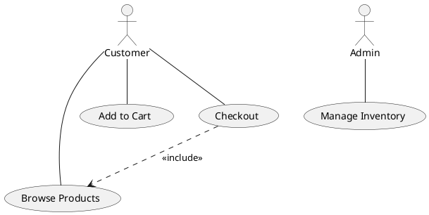
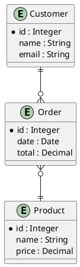

# puml-ld Test Examples

This document provides example PlantUML diagrams and their corresponding JSON-LD outputs.

## Example 1: Class Diagram

### Input PlantUML



### cURL Command

```bash
curl -X PUT http://localhost:4567/convert \
  -H 'Context: {"@vocab": "http://example.org/uml#", "name": "rdfs:label"}' \
  -H "Id: http://example.org/diagrams/company" \
  -H "Content-Type: text/plain" \
  --data-binary @class_diagram.puml
```

## Example 2: Sequence Diagram

### Input PlantUML



### cURL Command

```bash
curl -X PUT http://localhost:4567/convert \
  -H 'Context: {"@vocab": "http://example.org/uml#"}' \
  -H "Id: http://example.org/diagrams/login" \
  -H "Content-Type: text/plain" \
  --data-binary @sequence_diagram.puml
```

## Example 3: Use Case Diagram

### Input PlantUML



### cURL Command

```bash
curl -X PUT http://localhost:4567/convert \
  -H 'Context: {"@vocab": "http://example.org/uml#"}' \
  -H "Id: http://example.org/diagrams/ecommerce" \
  -H "Content-Type: text/plain" \
  --data-binary @usecase_diagram.puml
```

## Example 4: Entity Relationship Diagram

### Input PlantUML



### cURL Command

```bash
curl -X PUT http://localhost:4567/convert \
  -H 'Context: {"@vocab": "http://example.org/uml#"}' \
  -H "Id: http://example.org/diagrams/database" \
  -H "Content-Type: text/plain" \
  --data-binary @erd_diagram.puml
```

## Retrieving SHACL Shapes

### Get Class Diagram Shape

```bash
curl "http://localhost:4567/shacl?name=Class"
```

### Get Sequence Diagram Shape

```bash
curl "http://localhost:4567/shacl?name=Sequence"
```

### Get Use Case Diagram Shape

```bash
curl "http://localhost:4567/shacl?name=UseCase"
```

### Get ERD Shape

```bash
curl "http://localhost:4567/shacl?name=ERD"
```

## Testing with Different Contexts

### Using External Context URL

```bash
curl -X PUT http://localhost:4567/convert \
  -H "Context: https://schema.org/" \
  -H "Id: http://example.org/diagrams/test" \
  --data '@startuml
class Person
@enduml'
```

### Using Inline Complex Context

```bash
curl -X PUT http://localhost:4567/convert \
  -H 'Context: {"@vocab": "http://purl.org/ontology/bibo/", "uml": "http://example.org/uml#", "rdfs": "http://www.w3.org/2000/01/rdf-schema#"}' \
  -H "Id: http://example.org/diagrams/test" \
  --data '@startuml
class Book
@enduml'
```

## Error Handling Examples

### Missing Context Header

```bash
curl -X PUT http://localhost:4567/convert \
  -H "Id: http://example.org/diagrams/test" \
  --data '@startuml
class Person
@enduml'
```

**Expected Response:** 400 Bad Request with error message

### Missing Id Header

```bash
curl -X PUT http://localhost:4567/convert \
  -H 'Context: {"@vocab": "http://example.org/uml#"}' \
  --data '@startuml
class Person
@enduml'
```

**Expected Response:** 400 Bad Request with error message

### Invalid PlantUML

```bash
curl -X PUT http://localhost:4567/convert \
  -H 'Context: {"@vocab": "http://example.org/uml#"}' \
  -H "Id: http://example.org/diagrams/test" \
  --data 'this is not valid plantuml'
```

**Expected Response:** 422 Unprocessable Entity with parsing error

### Invalid SHACL Shape Name

```bash
curl "http://localhost:4567/shacl?name=InvalidDiagramType"
```

**Expected Response:** 404 Not Found with error message
